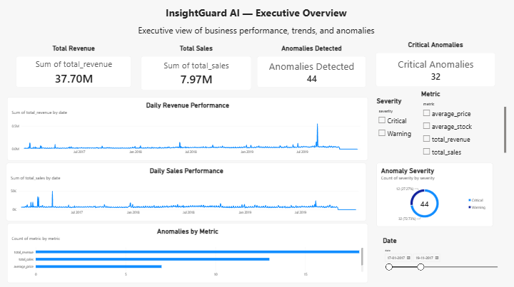
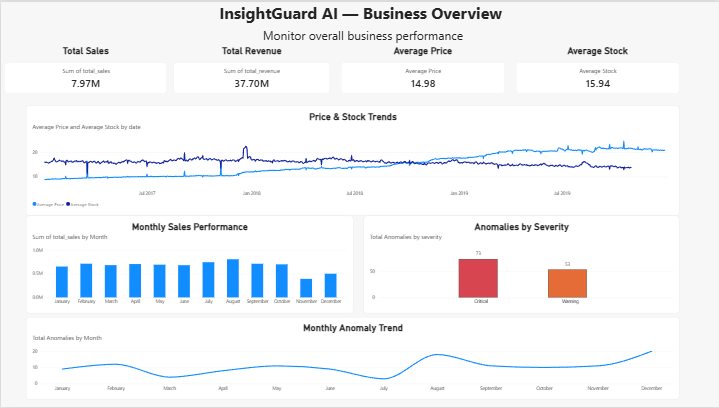
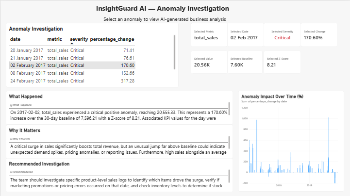

# 🚀 InsightGuard AI

### AI-Powered Business Intelligence & Anomaly Detection Dashboard

InsightGuard AI is an interactive **Microsoft Power BI dashboard** designed to monitor business performance, identify unusual KPI behavior, and help users investigate business anomalies through data-driven insights.

---

## 📊 Dashboard Preview

### Executive Overview

### Business Overview

### Anomaly Investigation

---

## 🎯 Project Overview

InsightGuard AI transforms business data into an interactive analytical dashboard that helps decision-makers quickly understand:

- 📈 Business performance
- 💰 Revenue and sales trends
- 📦 Stock and pricing behavior
- 🚨 Business anomalies
- ⚠️ Anomaly severity
- 🔍 KPI-level investigation
- 🤖 AI-generated business insights

---

## 📌 Dashboard Pages

### 1. Executive Overview

Provides a high-level summary of overall business performance.

**Key components:**
- Total Revenue
- Total Sales
- Anomalies Detected
- Critical Anomalies
- Daily Revenue Trend
- Daily Sales Trend
- Anomalies by KPI
- Anomaly Severity Distribution
- Interactive Date, Metric and Severity filters

---

### 2. Business Overview

Provides detailed analysis of business performance and trends.

**Key components:**
- Monthly Sales Performance
- Average Price vs Average Stock
- Total Anomalies by Severity
- Monthly Anomaly Trend
- Business performance KPIs

---

### 3. Anomaly Investigation

Allows users to investigate individual business anomalies.

**Key components:**
- Anomaly Date
- KPI / Metric
- Severity
- Percentage Change
- Selected Value
- Baseline Value
- Z-Score
- Anomaly Impact
- AI-generated explanation
- Recommended investigation

---

## 🛠️ Technologies Used

- **Microsoft Power BI**
- **Power Query**
- **DAX**
- **Data Visualization**
- **Business Intelligence**
- **KPI Analysis**
- **Anomaly Detection**
- **AI-assisted Insights**

---

## ⭐ Key Features

- Interactive dashboard navigation
- Dynamic filtering
- KPI monitoring
- Revenue and sales trend analysis
- Critical and warning anomaly classification
- Z-score based anomaly analysis
- Business impact analysis
- AI-generated explanations
- Recommended investigation actions
- Executive-level reporting

---

## 📂 Project Files

| File | Description |
|---|---|
| `InsightGuard-AI.pbix` | Complete Power BI dashboard |
| `executive-overview.png` | Executive Overview screenshot |
| `business-overview.png` | Business Overview screenshot |
| `anomaly-investigation.png` | Anomaly Investigation screenshot |

---

## 🚀 How to Use

1. Download `InsightGuard-AI.pbix`.
2. Open the file using **Microsoft Power BI Desktop**.
3. Explore the dashboard pages.
4. Use the filters to analyze different KPIs.
5. Select anomalies to investigate their business impact.

---

## 🔗 Live Power BI Demo

[View InsightGuard AI Dashboard](https://app.powerbi.com/links/SC6AKfyI7X?ctid=d122c069-d062-4c6a-9405-88dbb5295702&pbi_source=linkShare)

---

## 👨‍💻 Author

**Pratik Baviskar**

Aspiring Data Analyst | Business Intelligence | Power BI

---

⭐ If you found this project useful, consider giving the repository a star!
